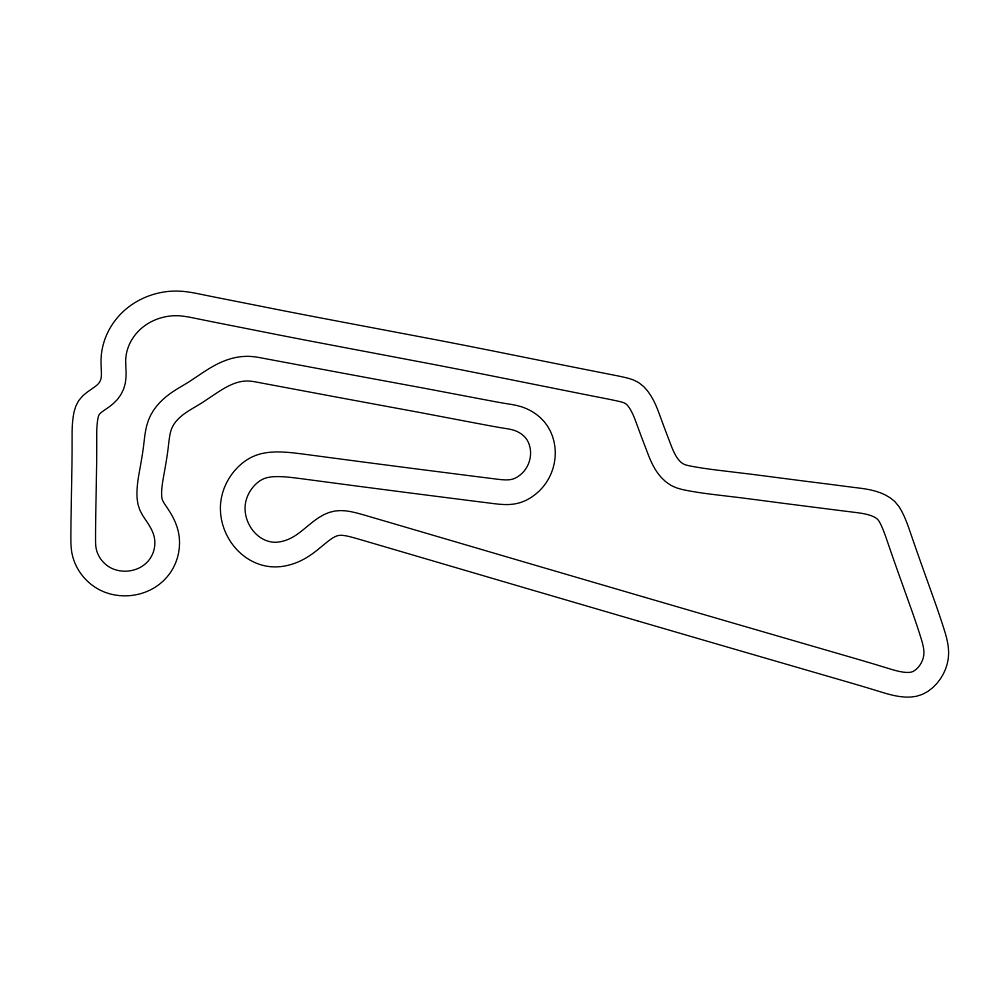
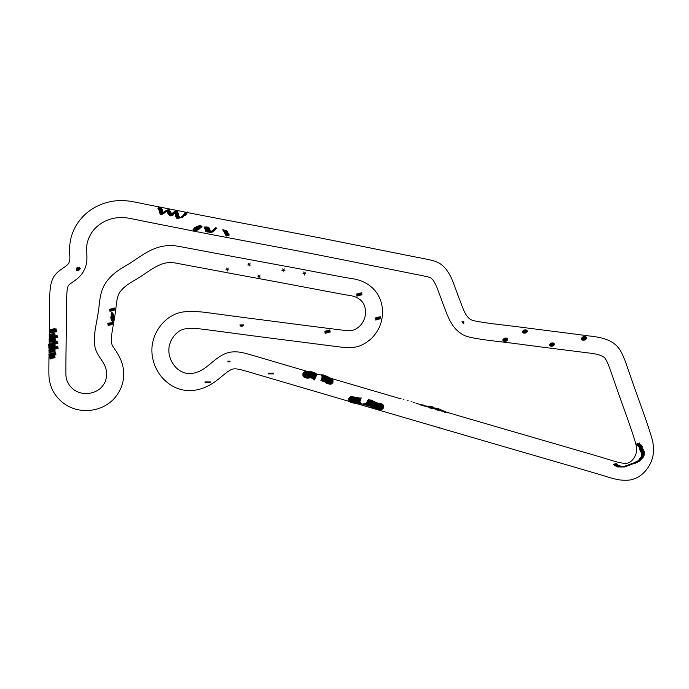
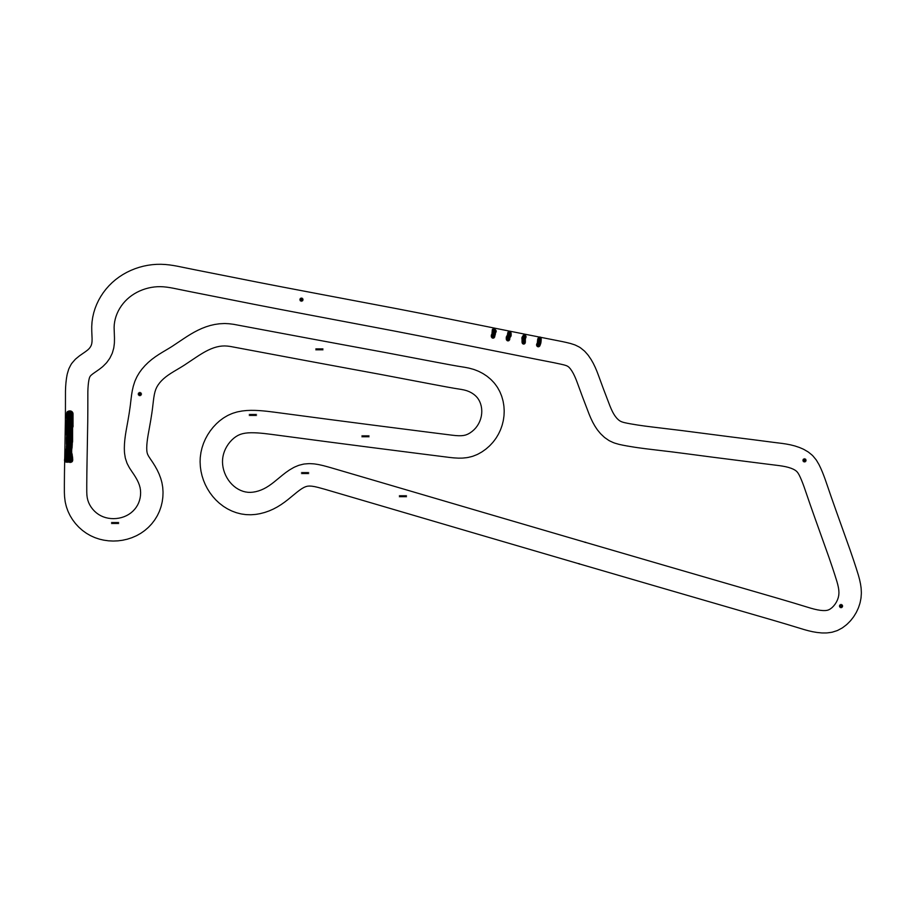
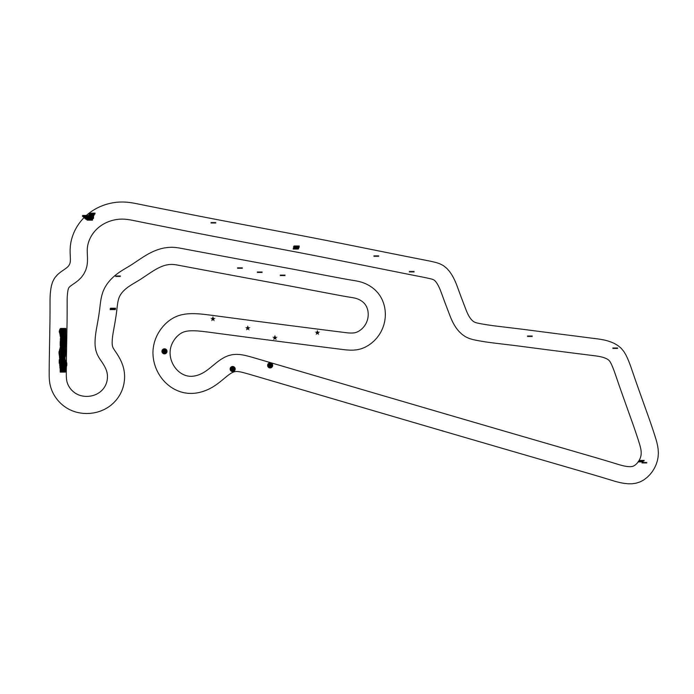

# A scalable deep reinforcement learning method for virtual autonomous racing on F1tenth environment

This project builds a wrapper for [f1tenth gym simulator](https://github.com/f1tenth/f1tenth_gym) and uses 
[RLLib](https://www.ray.io/rllib) to train deep reinforcement learning models at scale.

## Installation

This project is tested on python 3.8

First Install f1tenth gym environment from [here](https://github.com/f1tenth/f1tenth_gym)

Install Rllib from [here](https://docs.ray.io/en/master/rllib/index.html)

clone the project:
```
git clone https://github.com/navidmdn/f1tenth_rl.git
```

Install required libraries:
```
cd f1tenth_rl
pip install requirements.txt
```


## How it works

In order to train the agent in a robust way, a wrapper is made for this gym environment (`single_car_env.py`) this is a
wrapper environment which adds more sophisticated abilities for training models better.

I'm gonna walk you through building a fast agent on one of the maps available in this repo.

### building multiple maps for better generalization and safety

So, lets assume we want to train an agent on `Oschersleben` map. This is a famous racing track which was used in [F1tenth ICRA 2022](https://icra2022-race.f1tenth.org/)
virtual racing competition. You can find the png file in `maps/Oschersleben.png`:

<p align="center">
!
</p>

In order to build multiple tracks with different obstacles, I simply used linux's GIMP software and drew multiple challenging
obstacles on the map. For instance, I'm gonna walk you through training the agent using these three maps:

<p align="center">
!
</p>


<p align="center">
!
</p>


<p align="center">
!
</p>

### defining state, action and reward

#### state

At each timestep f1tenth gym environment gives the scan of environment from the agents perspective. Along with that,
it also gives the agent's position, velocity and angular velocity. In order to make agent more robust, I ignored the position
of the agent and used lidar scan, velocity and angular velocity as the state features. The wrapper performs some clipping, normalizations 
and concatenation to create a vectorized state for the environment.

#### action

Agent performs continuous actions which consists of velocity and angle of the car.

#### reward

The reward function that I came up with was encouraging the agent to travel through the track by setting
waypoints inside the track. To do so, you can generate the waypoints for a specific map by running `build_waypoints.py` file.
It runs a simple "follow the gap" model to traverse the track and record waypoints in a numpy file. Afterwards, in the wrapper, 
we can set the number of desired waypoints from that numpy file and whenever agent reaches each of those waypoints, 
we will give it some reward.

Also, to ensure agent is going as fast as it can, the reward is modified so that the agent receives some reward proportion to
the time difference between each two checkpoints it travels (i.e. the faster agent goes, more reward it collects when it reaches
checkpoints)

To avoid collision, returning and stopping, there are also negative rewards for them. Also, there is some
negative reward for agent when it gets too close to obstacles to ensure safety. All these reward values are configurable 
according to the environment.

### start training

I used PPO developed by RLLib library to train model. Since the episodes (driving whole track once) are too long, I ensured the 
agent will see all possible actions by setting it to random waypoints of different tracks at the start and also making it drive
the track in the opposite direction randomly.

Go to the project root directory and run:
```
PYTHONPATH=. python f1tenth_rl/train_ppo.py
```

This will log the training process to use in tensorboard inside of `runs/` folder.